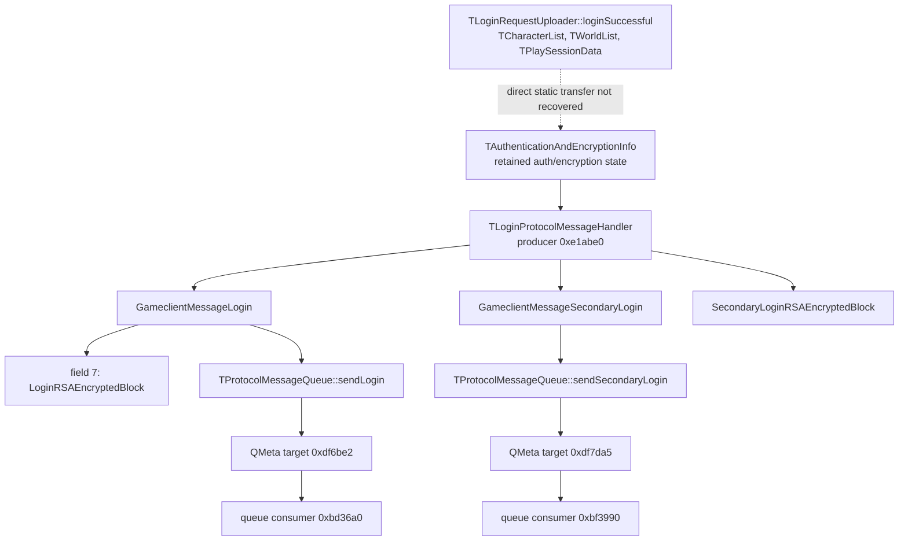

# Native game-login credential proof — official Linux client 15.32.df7b29

## Executive summary

This report closes the authorized static Track A follow-up to the native auth/session investigation.

The exact official Linux client proves that the game-server login path constructs a `GameclientMessageLogin` containing a nested `LoginRSAEncryptedBlock`, and that the native producer reads the values used to build that login from a retained `tibia::authentication::TAuthenticationAndEncryptionInfo` object.

The static evidence does **not** prove the semantic origin of every retained field in that object. In particular, it does not prove whether an account-password value is absent from, present in, or transformed into one of those retained fields. Therefore the only evidence-safe conclusion is:

```text
PASSWORD_REQUIRED_FOR_GAME_LOGIN: UNKNOWN
```

This does **not** reverse the separate exact-client finding from the parent auth/session investigation that the login **form UI can be skipped** when the native client has suitable retained state: form presentation and server authentication are separate layers.

## Exact-client fence

```text
version: 15.32.df7b29
platform: official native Linux client
size: 51965216
sha256: e6c244bd39fe2e0632f6f000efd3147164696efa8e901718668e0442325ff7fe
runtime_access: none
```

Every promoted binary claim in this task was recovered only after exact packed/unpacked fencing. No live login, secret values, packet payloads, process memory, X11 observation, or physical Track A runtime was used.

## Final decision table

| Question | Result | Classification |
|---|---|---|
| Native game-login message type | `GameclientMessageLogin` | FACT |
| Protected/nested login block | `LoginRSAEncryptedBlock`, field 7 | FACT |
| Native producer | `TLoginProtocolMessageHandler` function `0xe1abe0` | FACT |
| Retained producer source | `TAuthenticationAndEncryptionInfo` | FACT |
| Retained source vtable | `0x2f63240` | FACT |
| Queue entry | `TProtocolMessageQueue::sendLogin(GameclientMessageLogin)` | FACT |
| Primary queue consumer | `0xbd36a0` | FACT |
| Secondary login | distinct `GameclientMessageSecondaryLogin` + `SecondaryLoginRSAEncryptedBlock` | FACT |
| `PASSWORD_REQUIRED_FOR_GAME_LOGIN` | `UNKNOWN` | UNKNOWN |
| Password absent from game-login | not proven | UNKNOWN |
| Password present in game-login | not proven | UNKNOWN |
| Retained auth/encryption state participates in game-login construction | yes | FACT |

## Native call/data graph



The dashed edge is deliberately **not** promoted to FACT by this task.

## Protobuf wire structure

### `GameclientMessageLogin`

The generated protobuf serializer/`ByteSizeLong` code proves seven fields:

```text
field 1: varint            object offset +0x30
field 2: varint            object offset +0x34
field 3: varint            object offset +0x38
field 4: length-delimited  object offset +0x18
field 5: length-delimited  object offset +0x20
field 6: varint            object offset +0x3c
field 7: length-delimited  object offset +0x28
         nested type = LoginRSAEncryptedBlock
```

Field 7 is not a proximity inference: its size branch calls `LoginRSAEncryptedBlock::ByteSizeLong @ 0x175d5e0`, and serialization uses protobuf field number 7 for that nested object.

### `LoginRSAEncryptedBlock`

```text
field 1: length-delimited  offset +0x18  tag 0x0a
field 2: length-delimited  offset +0x20  tag 0x12
field 3: varint            offset +0x40  tag 0x18
field 4: varint            offset +0x44  tag 0x20
field 5: length-delimited  offset +0x28  tag 0x2a
field 6: length-delimited  offset +0x30  tag 0x32
field 7: length-delimited  offset +0x38  tag 0x3a
```

Exact semantic protobuf field names were not recoverable from promotable descriptor material. A descriptor-recovery attempt failed closed rather than assigning names from string proximity.

## Producer provenance

The bounded exact-client producer probe identifies:

```text
producer function: 0xe1abe0
owner RTTI: tibia::authentication::TLoginProtocolMessageHandler
owner vtable: 0x3084e00
producer slot: +0x60
```

It also identifies the source-object vtable used by the producer:

```text
source vtable: 0x2f63240
source typeinfo: 0x3077840
source RTTI: tibia::authentication::TAuthenticationAndEncryptionInfo
```

The primary branch creates the `GameclientMessageLogin`/`LoginRSAEncryptedBlock` pair; the secondary branch creates the distinct secondary-login pair. The function reads multiple retained source regions, including string-like values in the `+0xd0 .. +0x170` range, through direct fast paths and virtual getter fallbacks.

These observations prove **where** the native game-login values come from at the message-construction boundary. They do not provide trustworthy semantic names for every retained value.

## Queue boundary

Exact QMeta recovery for `TProtocolMessageQueue` proves:

```text
sendLogin(GameclientMessageLogin)
    -> QMeta target 0xdf6be2
    -> 0xbd36a0

sendSecondaryLogin(GameclientMessageSecondaryLogin)
    -> QMeta target 0xdf7da5
    -> 0xbf3990
```

Therefore `0xbd36a0` is not an unknown serializer candidate: it is downstream of an already-created `GameclientMessageLogin`. Credential semantics must be established upstream at the producer/state boundary.

## Initial authentication vs game-server login

The related exact-client auth/session work recovered the initial-auth success boundary:

```text
TLoginRequestUploader::loginSuccessful(
    TCharacterList,
    TWorldList,
    TPlaySessionData
)
```

and a native state-machine shortcut directly to character selection:

```text
TAuthenticationProcessController::advanceStateMachineDirectlyToCharacterSelection
@ 0xcfadcb
```

Those findings prove an architectural separation between login-form presentation, initial authentication state, character selection, and later game-server login construction.

They are **not**, by themselves, proof that no password-derived value can exist inside `TAuthenticationAndEncryptionInfo`.

## Final receiver-side discriminator

The final narrow static run recovered the controller QMeta table and promoted these login-success-related zero-argument receiver methods:

```text
onLoginFinishedSuccessfullyEntered()       case 0xcfa63d
onConfirmationCodeLoginSuccessful()        case 0xcfa69d
```

No promoted receiver method in that table exposed `TPlaySessionData` in its decoded signature, and bounded receiver analysis did not establish a direct write into the `TAuthenticationAndEncryptionInfo` vtable/type path.

Consequently this task cannot prove the missing semantic edge:

```text
TPlaySessionData
    -> specific retained TAuthenticationAndEncryptionInfo field
    -> specific LoginRSAEncryptedBlock field
```

## Password decision

### FACT

`GameclientMessageLogin` is constructed from retained `TAuthenticationAndEncryptionInfo` state rather than directly from a login-form widget at the queue/send boundary.

### INFERENCE

The architecture strongly favors post-auth retained session/authentication/encryption material as the game-login credential source. This is consistent with the separate native existing-credentials/session path and with comparative protocol observations.

### UNKNOWN

Whether one of the retained values consumed by `0xe1abe0` is the account password, a password-derived value, or exclusively session/challenge material is not statically proven.

Therefore:

```text
PASSWORD_REQUIRED_FOR_GAME_LOGIN: UNKNOWN
PASSWORD_ABSENT_FROM_GAME_LOGIN: NOT PROVEN
PASSWORD_PRESENT_IN_GAME_LOGIN: NOT PROVEN
```

## Practical UI-bypass consequence

The unresolved game-server password semantic does **not** mean the manual login form is required.

The parent exact-client investigation already recovered a native zero-argument transition directly to character selection. Thus the UI decision remains:

```text
CAN_SKIP_LOGIN_FORM: YES
```

when the client has suitable valid retained authentication/session state. If no valid state exists, legitimate initial authentication—including any server-required password, 2FA, device confirmation, or other challenge—must still occur; this research does not bypass those controls.

## Security boundary

No credential or session value was recorded. No authentication server or game server was logged into by this task. No TLS control was weakened. No live client process was observed. PR #475's physical runtime/session was not touched or inherited.

## Terminal status

```text
AUTHORIZED_STATIC_TASK: COMPLETED
RESEARCH_RESULT: PARTIAL
PASSWORD_REQUIRED_FOR_GAME_LOGIN: UNKNOWN
STATIC_SCOPE_EXHAUSTED: YES
```

A future runtime provenance task, if desired, requires independent Track A admission and should observe only provenance/categories or control-flow edges, never secret values. It is outside this task.
